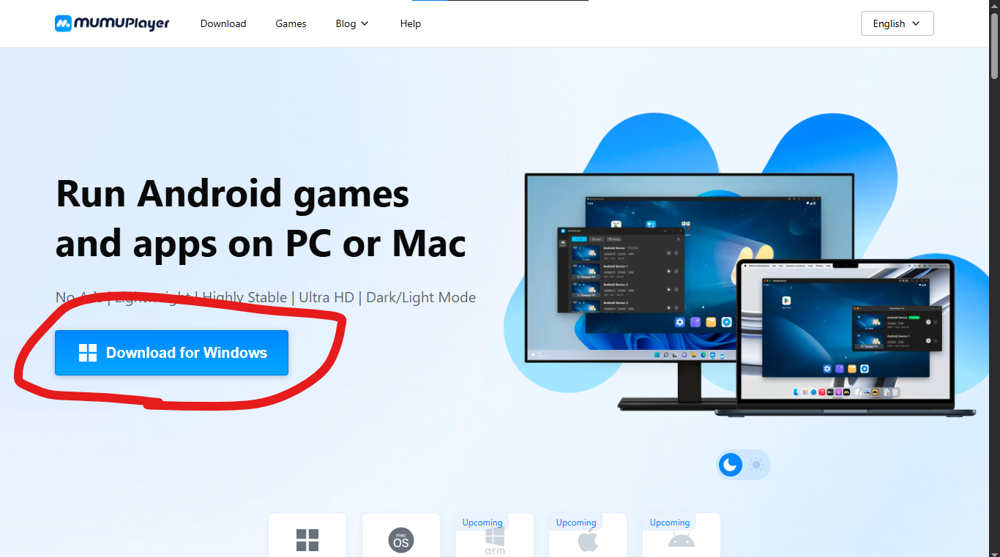
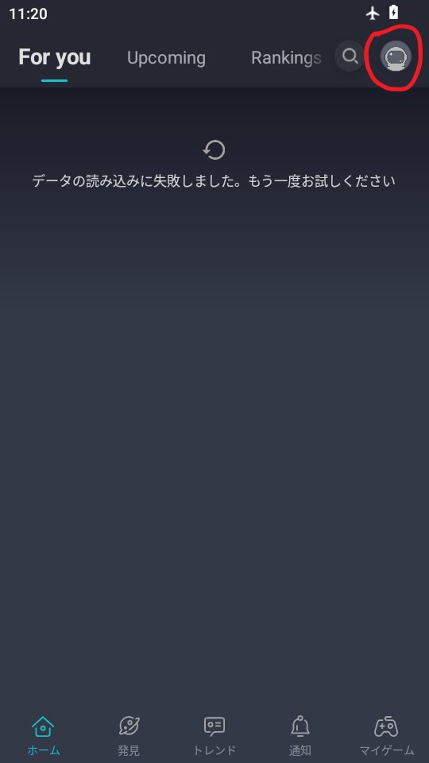
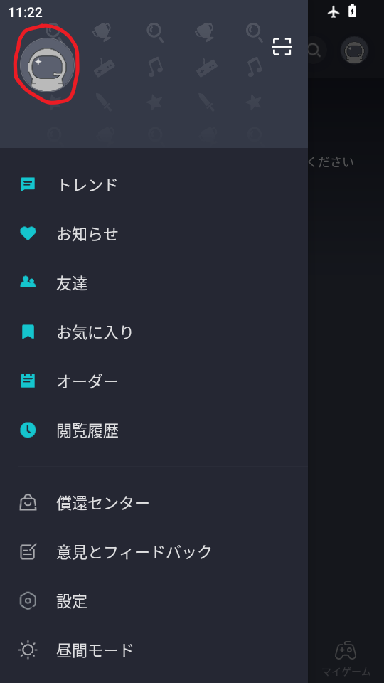
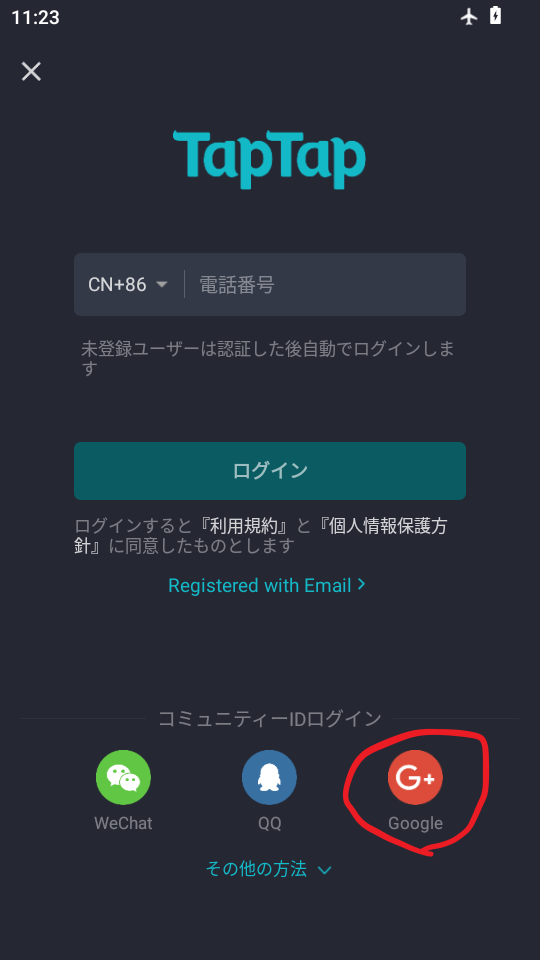
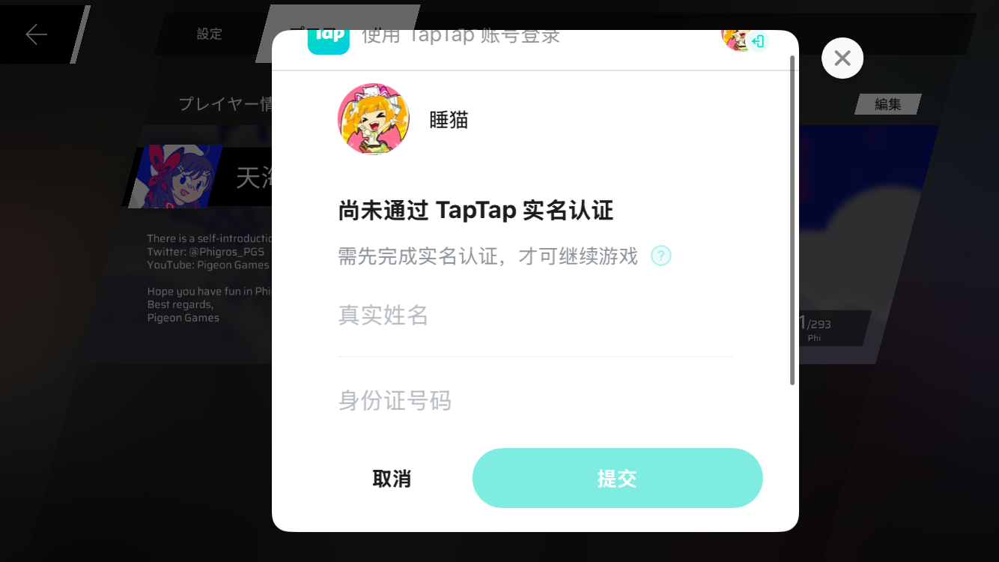
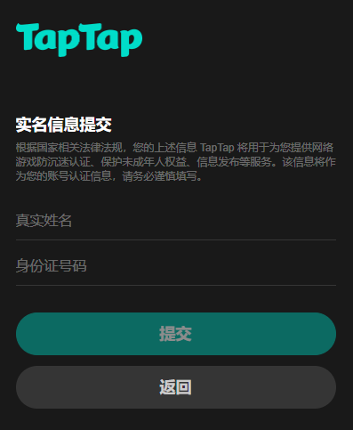

# Phigros のクラウド同期が使いたいので中国大陸版 Taptap アカウントを登録してみた

> [!Warning]
> Google アカウントやマイナンバーカードを(実質)中国政府管轄の企業に献上することは推奨されません。  
> 試す際は自己責任でお願いします。

どうも！ねんねこです。記念すべきまともな記事 1 つ目はタイトルの通り、「中国大陸版 Taptap アカウントを登録すること」です！

Taptap は国によって 2 つのサービスに分けられており、「[Taptap International](https://taptap.io)」と「[Taptap](https://taptap.cn)」があります。が、Phigros のログインには、「Taptap」のほうしか使えません。(なお同じ Taptap によるクラウドセーブを使用している Rotaeno は (日本では)International)

しかし通常の方法では中国大陸の電話番号を求められるため登録できません。ですがとある方法を用いることで登録を行うことができるんです！

今回はその方法を用いて実際に登録してみました。

> [!Note]
> 本記事はこちらのガイドを参考にしています。  
> <https://docs.google.com/document/d/1UdlnmB--Gy9nDbIoM-nikQH2emMzmaWnCz_M_NmFULE/edit?tab=t.0#heading=h.jsqxyuo91q3l>

## 必要なもの

- Android スマホ (なくてもいいです。後述)
- Taptap International に**連携していない** Google アカウント

## Mumu をインストールする (Android を持っていない場合)

Android を持っていない場合、<https://www.mumuplayer.com/> から Mumu をインストールします。
私の場合母が Android を持っていますが、とても借りられる状況では無さそうだったので Mumu をインストールします。



「Download for Windows」ボタンを押し exe ファイルをダウンロード後、exe ファイルを開き Mumu をインストールします。  
インストールできたら次のステップに進めます。

## 旧バージョンの Taptap をインストールする

<https://taptap.en.uptodown.com/android/download/3123991> ([ミラー](https://mega.nz/file/pxg3TILK#D05CkvpePQmAw8fDXbT3LpkFMZaXXPgC4_-URo5G8fo)) から旧バージョンの Taptap をダウンロードします。ファイル形式は apk です。

ダウンロードできたら Android にインストールしてください。(Mumu の場合ホーム画面で apk をドラッグアンドドロップすることでインストールできます。)

## Taptap アカウントを作る

**Android を機内モードにして**、Taptap を起動します。  
機内モードを OFF にしないとバージョンチェックが入ってログインできなくなります。


「データの読み込みに失敗しました。もう一度お試しください」と表示されますが正常です(日本語で表示されるのも正常)。

起動できたら右上のアイコンをタッチし、出てきたサイドバーの上部にあるアイコンをもう一度タッチしてください。




アイコンをタッチした後、ログインを求められます。ここで機内モードを OFF にし、Google アカウントでログインしてください。

> [!Note]
> Taptap のアップデートを求められた際は、バツボタンや取消ボタンをおして抵抗してください。



ログインできたら各種規約に同意し、アカウント名を入力します。

Taptap アカウントの登録が完了しました。  
Taptap アプリは削除してください。

## 実名認証 (实名认证)

中国のサービスではだいたい求められる実名認証。Taptap も例外ではありません。  
Phigros にログインしようとすると氏名と中国の ID 番号による実名認証を求められ


アカウントセンターから実名認証しようとしても氏名と中国の ID 番号による実名認証を求められます。



しかしある手順を踏めば日本に住んでいても実名認証を行うことができます。

> [!Note]
> 中国大陸にお住まいの方はこんなめんどくさい手順を踏む必要はありません。

> [!Warning]
> マイナンバーカードを(実質)中国政府管轄の企業に献上することは推奨されません。  
> 試す際は自己責任でお願いします。

### 必要なもの

- マイナンバーカード または パスポート(パスポートを持っていないためパスポートの手順は書きません)

### 実名認証を行う

「图片 (画像)」にはマイナンバーカードまたはパスポートの本人を証明できる写真(マイナンバーカードなら表面)を添付します。  
「问题描述 (問題の説明)」には適当に簡体字に翻訳して書いておきます。

```
我不住在中国大陆，也没有中国的身份证号码，因此无法进行实名认证。
```

实名信息(実名情報)には以下の情報を書いておきます。

```
1. 氏名
2. 生年月日
3. 住んでいる国及びID番号(マイナンバーカードの場合個人番号、パスポートの場合旅券番号)
```

例:

```
1. 天海ねこ
2. 2000年8月31日
3. 114514364364
```

「实名认证类型 (実名認証の種別)」には「非中国大陆用户实名认证 (中国本土以外のユーザー向け実名認証)」を指定します。

・・・とここまで書いておきましたが、2026/01/08 11:44 現在実名認証が通っていません。  
通ったら再びお知らせします。
